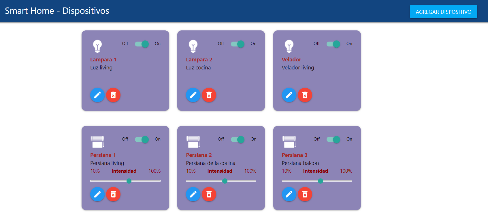
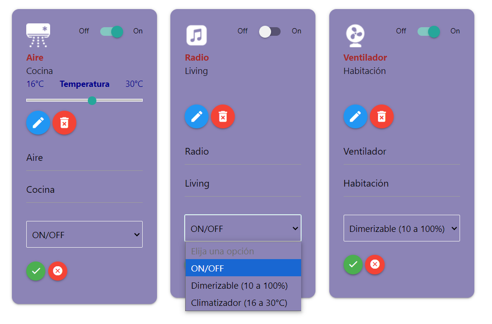
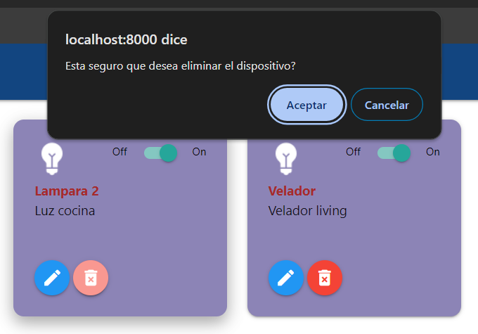

<a href="https://www.gotoiot.com/">
    
</a>

# Web App Full Stack Base 📡

## Introducción 🌐
Este proyecto se desarrolló como trabajo final de la materia **Desarrollo de Aplicaciones Web**, parte del posgrado **Maestría en Internet de las Cosas** del **Laboratorio de Sistemas Embebidos** de la **Facultad de Ingeniería de la Universidad de Buenos Aires**.

## Comenzando 🚀

Esta sección es una guía con los pasos escenciales para que puedas poner en marcha la aplicación.

<details><summary><b>Mira los pasos necesarios</b></summary><br>

### Instalar las dependencias

Para correr este proyecto es necesario que instales `Docker` y `Docker Compose`. 

En [este artículo](https://www.gotoiot.com/pages/articles/docker_installation_linux/) publicado en nuestra web están los detalles para instalar Docker y Docker Compose en una máquina Linux. Si querés instalar ambas herramientas en una Raspberry Pi podés seguir [este artículo](https://www.gotoiot.com/pages/articles/rpi_docker_installation) de nuestra web que te muestra todos los pasos necesarios.

En caso que quieras instalar las herramientas en otra plataforma o tengas algún incoveniente, podes leer la documentación oficial de [Docker](https://docs.docker.com/get-docker/) y también la de [Docker Compose](https://docs.docker.com/compose/install/).

Continua con la descarga del código cuando tengas las dependencias instaladas y funcionando.

### Descargar el código

Para descargar el código, lo más conveniente es que realices un `fork` de este proyecto a tu cuenta personal haciendo click en [este link](https://github.com/gotoiot/app-fullstack-base/fork). Una vez que ya tengas el fork a tu cuenta, descargalo con este comando (acordate de poner tu usuario en el link):

```
git clone https://github.com/DenisGenero/app-fullstack-base.git
```

> En caso que no tengas una cuenta en Github podes clonar directamente este repo.

### Ejecutar la aplicación

Para ejecutar la aplicación tenes que correr el comando `docker-compose up` desde la raíz del proyecto. Este comando va a descargar las imágenes de Docker de node, de typescript, de la base datos y del admin de la DB, y luego ponerlas en funcionamiento. 

Para acceder al cliente web ingresa a a la URL [http://localhost:8000/](http://localhost:8000/) y para acceder al admin de la DB accedé a [localhost:8001/](http://localhost:8001/). 

Si pudiste acceder al cliente web y al administrador significa que la aplicación se encuentra corriendo bien. 

> Si te aparece un error la primera vez que corres la app, deteńe el proceso y volvé a iniciarla. Esto es debido a que el backend espera que la DB esté creada al iniciar, y en la primera ejecución puede no alcanzar a crearse. A partir de la segunda vez el problema queda solucionado.

</details>

Continuá explorando el proyecto una vez que lo tengas funcionando.

## Configuraciones de funcionamiento 🔩

Al crearse la aplicación se ejecutan los contenedores de Docker de cada servicio, se crea la base de datos y sus tablas. A continuación podés encontrar info si querés cambiar la estructura de la DB o bien sus configuraciones de acceso.

<details><summary><b>Lee cómo configurar la aplicación</b></summary><br>

### Configuración de la DB

Como ya comprobaste, para acceder PHPMyAdmin tenés que ingresar en la URL [localhost:8001/](http://localhost:8001/). En el login del administrador, el usuario para acceder a la db es `root` y contraseña es la variable `MYSQL_ROOT_PASSWORD` del archivo `docker-compose.yml`.

Para el caso del servicio de NodeJS que se comunica con la DB fijate que en el archivo `src/backend/mysql-connector.js` están los datos de acceso para ingresar a la base.

Si quisieras cambiar la contraseña, puertos, hostname u otras configuraciones de la DB deberías primero modificar el servicio de la DB en el archivo `docker-compose.yml` y luego actualizar las configuraciones para acceder desde PHPMyAdmin y el servicio de NodeJS.

### Estructura de la DB

Al iniciar el servicio de la base de datos, si esta no está creada toma el archivo que se encuentra en `db/dumps/smart_home.sql` para crear la base de datos automáticamente.

En ese archivo está la configuración de la tabla `Devices` y otras configuraciones más. Si quisieras cambiar algunas configuraciones deberías modificar este archivo y crear nuevamente la base de datos para que se tomen en cuenta los cambios.

Tené en cuenta que la base de datos se crea con permisos de superusuario por lo que no podrías borrar el directorio con tu usuario de sistema, para eso debés hacerlo con permisos de administrador. En ese caso podés ejecutar el comando `sudo rm -r db/data` para borrar el directorio completo.

</details>

## Detalles principales 🔍

En esta sección vas a encontrar las características más relevantes del proyecto.

<details><summary><b>Mira los detalles más importantes de la aplicación</b></summary><br>
<br>

### Arquitectura de la aplicación

Como ya pudiste ver, la aplicación se ejecuta sobre el ecosistema Docker, y en esta imagen podés ver el diagrama de arquitectura.


### El cliente web

El cliente web es una Single Page Application que se comunica con el servicio en NodeJS mediante JSON a través de requests HTTP. Puede consultar el estado de dispositivos en la base de datos (por medio del servicio en NodeJS) y también cambiar el estado de los mismos. Los estilos del código están basados en **Material Design**.

### El servicio web

El servicio en **NodeJS** posee distintos endpoints para comunicarse con el cliente web mediante requests HTTP enviando **JSON** en cada transacción. Procesando estos requests es capaz de comunicarse con la base de datos para consultar y controlar el estado de los dispositivos, y devolverle una respuesta al cliente web también en formato JSON. Así mismo el servicio es capaz de servir el código del cliente web.

### La base de datos

La base de datos se comunica con el servicio de NodeJS y permite almacenar el estado de los dispositivos en la tabla **Devices**. Ejecuta un motor **MySQL versión 5.7** y permite que la comunicación con sus clientes pueda realizarse usando usuario y contraseña en texto plano. En versiones posteriores es necesario brindar claves de acceso, por este motivo la versión 5.7 es bastante utilizada para fases de desarrollo.

### El administrador de la DB

Para esta aplicación se usa **PHPMyAdmin**, que es un administrador de base de datos web muy utilizado y que podés utilizar en caso que quieras realizar operaciones con la base, como crear tablas, modificar columnas, hacer consultas y otras cosas más.

### El compilador de TypeScript

**TypeScript** es un lenguaje de programación libre y de código abierto desarrollado y mantenido por Microsoft. Es un superconjunto de JavaScript, que esencialmente añade tipos estáticos y objetos basados en clases. Para esta aplicación se usa un compilador de TypeScript basado en una imagen de [Harmish](https://hub.docker.com/r/harmish) en Dockerhub, y está configurado para monitorear en tiempo real los cambios que se realizan sobre el directorio **src/frontend/ts** y automáticamente generar código compilado a JavaScript en el directorio  **src/frontend/js**. Los mensajes del compilador aparecen automáticamente en la terminal al ejecutar el comando **docker-compose up**.

### Ejecución de servicios

Los servicios de la aplicación se ejecutan sobre **contenedores de Docker**, así se pueden desplegar de igual manera en diferentes plataformas. Los detalles sobre cómo funcionan los servicios los podés ver directamente en el archivo **docker-compose.yml**.

### Organización del proyecto

En la siguiente ilustración podés ver cómo está organizado el proyecto para que tengas en claro qué cosas hay en cada lugar.

```sh
├── db                          # directorio de la DB
│   ├── data                    # estructura y datos de la DB
│   └── dumps                   # directorio de estructuras de la DB
│       └── smart_home.sql      # estructura con la base de datos "smart_home"
├── doc                         # documentacion general del proyecto
└── src                         # directorio codigo fuente
│   ├── backend                 # directorio para el backend de la aplicacion
│   │   ├── index.js            # codigo principal del backend
│   │   ├── mysql-connector.js  # codigo de conexion a la base de datos
│   │   ├── package.json        # configuracion de proyecto NodeJS
│   │   └── package-lock.json   # configuracion de proyecto NodeJS
│   └── frontend                # directorio para el frontend de la aplicacion
│       ├── js                  # codigo javascript que se compila automáticamente
│       ├── static              # donde alojan archivos de estilos, imagenes, fuentes, etc.
│       ├── ts                  # donde se encuentra el codigo TypeScript a desarrollar
│       └── index.html          # archivo principal del cliente HTML
├── docker-compose.yml          # archivo donde se aloja la configuracion completa
├── README.md                   # este archivo
├── CHANGELOG.md                # archivo para guardar los cambios del proyecto
├── LICENSE.md                  # licencia del proyecto
```

> No olvides ir poniendo tus cambios en el archivo `CHANGELOG.md` a medida que avanzas en el proyecto.

</details>

## Detalles de implementación 💻

En esta sección podés ver los detalles específicos de funcionamiento del código y que son los siguientes.

<details><summary><b>Mira los detalles de implementación</b></summary><br>

### Descripción del Proyecto 📋
El sistema web es una aplicación de página simple (SPA, *Single Page Application*). Al iniciarse, realiza una consulta a la base de datos para mostrar los dispositivos almacenados junto con su estado actual (ver Figura 1). Estos dispositivos se presentan en tarjetas, donde se muestran las características principales de cada uno. Dependiendo del tipo de dispositivo, la interfaz permite realizar diferentes acciones, y además, muestra una imagen que dependerá del nombre del dispositivo.  



### Interacciones entre Frontend y Backend 🔄  

#### Agregar un Dispositivo ➕
Al presionar el botón "Agregar dispositivo", se despliega un formulario que permite ingresar la información necesaria: nombre, descripción (ubicación en la casa), tipo de dispositivo (ON/OFF, dimmerizable o con regulación de temperatura), como se puede ver en la Figura 2. Al aceptar, si todos los campos están completos, el dispositivo se añadirá a la base de datos y aparecerá en la interfaz. Si algún campo está incompleto, se mostrará una alerta, solicitando al usuario completar la información faltante. Además, la operación puede cancelarse en cualquier momento presionando el botón "Cancelar".  


#### Editar un Dispositivo ✏️
Para editar un dispositivo, se debe hacer clic en el botón azul correspondiente. Al hacerlo, se desplegará un formulario con los campos editables ya cargados con la información del dispositivo (ver Figura 3). Hay dos botones disponibles: uno para aceptar los cambios, que actualizará tanto la base de datos como la interfaz, y otro para cancelar la edición, ocultando el formulario.



#### Eliminar un Dispositivo 🗑️
Para eliminar un dispositivo, se debe hacer clic en el botón rojo de la tarjeta correspondiente. Aparecerá una ventana emergente pidiendo confirmación de la acción (ver Figura 4). Si se confirma, el dispositivo se eliminará de la base de datos y de la interfaz.



#### Regulación de intensidad 🔆 o temperatura 🌡️
Si un dispositivo es regulable aparecerá una barra deslizable en la parte inferior de su respectiva tarjeta. Dependiendo del tipo de dispositivo dicha barra permitirá regular su intencidad desde el 10 al 10% o su temperatura de 16 a 30°C. Esta información se actualizará en la base de datos

### Endpoints del Backend ⚙️

| Método | Endpoint            | Descripción                                                                                      | Respuesta exitosa | Respuesta en error |
|--------|---------------------|--------------------------------------------------------------------------------------------------|------------------|-------------------|
| GET    | `/devices/`          | Recupera todos los dispositivos de la base de datos.                                             | 200 (lista de dispositivos) | 409 (mensaje de error) |
| POST   | `/device`            | Inserta un nuevo dispositivo. Los campos requeridos son `name`, `description` y `type`. El estado se inicializa en `false`. | 200 (respuesta de la base de datos) | 400 (error en los datos), 409 (mensaje de error) |
| PUT    | `/device/info/`      | Actualiza los campos `name`, `description` y `type` de un dispositivo existente mediante su `id`. | 204 (sin contenido) | 409 (mensaje de error) |
| PUT    | `/device/state/`     | Actualiza el campo `state` (estado ON/OFF) de un dispositivo mediante su `id`.                                | 204 (sin contenido) | 409 (mensaje de error) |
| PUT    | `/device/control/`   | Actualiza el campo `control` (intensidad o temperatura) de un dispositivo mediante su `id`.                                | 204 (sin contenido) | 409 (mensaje de error) |
| DELETE | `/device/:id`        | Elimina un dispositivo según su `id`. 

## Tecnologías utilizadas 🛠️

En esta sección podés ver las tecnologías más importantes utilizadas.

<details><summary><b>Mira la lista completa de tecnologías</b></summary><br>

* [Docker](https://www.docker.com/) - Ecosistema que permite la ejecución de contenedores de software.
* [Docker Compose](https://docs.docker.com/compose/) - Herramienta que permite administrar múltiples contenedores de Docker.
* [Node JS](https://nodejs.org/es/) - Motor de ejecución de código JavaScript en backend.
* [MySQL](https://www.mysql.com/) - Base de datos para consultar y almacenar datos.
* [PHPMyAdmin](https://www.phpmyadmin.net/) - Administrador web de base de datos.
* [Material Design](https://material.io/design) - Bibliotecas de estilo responsive para aplicaciones web.
* [TypeScript](https://www.typescriptlang.org/) - Superset de JavaScript tipado y con clases.

</details>

## Autor 👥

* **[Denis Genero](https://github.com/DenisGenero)**
