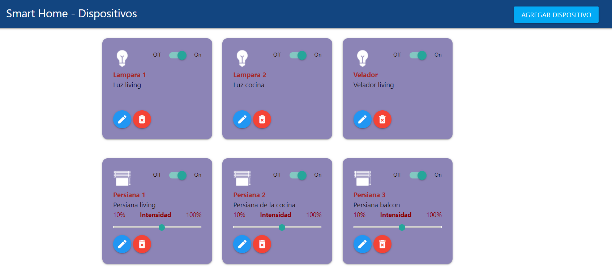

# 📡 Sistema IoT para Controlar Dispositivos

## 🌐 Introducción
Este proyecto se desarrolló como trabajo final de la materia **Desarrollo de Aplicaciones Web**, parte del posgrado **Maestría en Internet de las Cosas** del **Laboratorio de Sistemas Embebidos** de la **Facultad de Ingeniería de la Universidad de Buenos Aires**.

## 🛠️ Herramientas Utilizadas
- **Docker**: Utilizamos Docker para levantar tanto el servidor como la base de datos, simplificando el desarrollo mediante imágenes preconfiguradas de software. Esto permite un uso inmediato con pocas configuraciones.
- **Ajax**: Ajax se utilizó para renderizar componentes en tiempo de ejecución sin recargar la página completa, lo que mejora el desempeño y optimiza los recursos.
- **Materialize**: Este framework de Google facilitó el desarrollo de componentes visuales flexibles y mejoró la estética general de la interfaz de usuario.

## 📋 Descripción del Proyecto
El sistema web es una aplicación de página simple (SPA, *Single Page Application*). Al iniciarse, realiza una consulta a la base de datos para mostrar los dispositivos almacenados junto con su estado actual (ver Figura 1). Estos dispositivos se presentan en tarjetas, donde se muestran las características principales de cada uno. Dependiendo del tipo de dispositivo, la interfaz permite realizar diferentes acciones.

### 📂 Acciones:

#### ➕ Agregar un Dispositivo
Al presionar el botón "Agregar dispositivo", se despliega un formulario que permite ingresar la información necesaria: nombre, descripción (ubicación), tipo de dispositivo (ON/OFF, dimmer o con regulación de temperatura) (ver Figura 2). Al aceptar, si todos los campos están completos, el dispositivo se añadirá a la base de datos y aparecerá en la interfaz. Si algún campo está incompleto, se mostrará una alerta, solicitando al usuario completar la información faltante. Además, la operación puede cancelarse en cualquier momento presionando el botón "Cancelar".

#### ✏️ Editar un Dispositivo
Para editar un dispositivo, se debe hacer clic en el botón azul correspondiente. Al hacerlo, se desplegará un formulario con los campos editables ya cargados con la información del dispositivo (ver Figura 3). Hay dos botones disponibles: uno para aceptar los cambios, que actualizará tanto la base de datos como la interfaz, y otro para cancelar la edición, ocultando el formulario.

#### 🗑️ Eliminar un Dispositivo
Para eliminar un dispositivo, se debe hacer clic en el botón rojo de la tarjeta correspondiente. Aparecerá una ventana emergente pidiendo confirmación de la acción (ver Figura 4). Si se confirma, el dispositivo se eliminará de la base de datos y de la interfaz.
